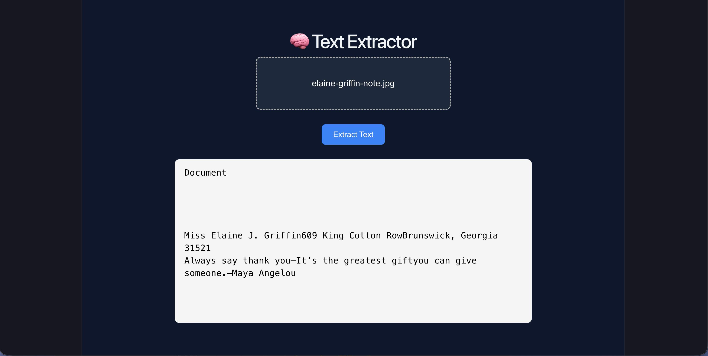

# AI Text Extractor


> An AI-powered web application that extracts text from images and PDFs using OCR and presents it in a clean, readable format.

---

## Features

* 📂 Upload images or PDFs
* 🧠 AI-based text extraction using Sarvam AI
* 🖥️ Clean and minimal UI (React)
* ⚡ Fast backend powered by FastAPI
* 🔐 Secure API key handling with `.env`
* 📜 Supports both printed and handwritten text

---

## Tech Stack

### Frontend

* React (Vite)
* JavaScript
* CSS

### Backend

* FastAPI
* Python
* Sarvam AI OCR API
* Pillow (Image Processing)
* BeautifulSoup (HTML parsing)

---

## Project Structure

```
text-extractor/
│
├── backend/
│   ├── services/
│   ├── utils/
│   ├── main.py
│   ├── .env (ignored)
│
├── frontend/
│   ├── src/
│   ├── App.jsx  
|   ├── index.css
│   ├── main.jsx
│
├── README.md
├── .gitignore
```

---

## Setup Instructions

### Clone Repository

```bash
git clone https://github.com/your-username/text-extractor.git
cd text-extractor
```

---

### Backend Setup

```bash
cd backend
python -m venv venv
source venv/bin/activate  # mac/linux
pip install -r requirements.txt
```

---

### Add Environment Variables

Create `.env` file in backend:

```
SARVAM_API_KEY=your_api_key_here
```

---

### Run Backend

```bash
uvicorn main:app --reload
```

---

### Frontend Setup

```bash
cd frontend
npm install
npm run dev
```

---

## Usage

1. Open the frontend in browser
2. Upload an image or PDF
3. Click **Extract Text**
4. View extracted content instantly

---

## Demo

> *(ScreenShots of the App)*


---

## Security

* API keys are stored securely using `.env`
* `.env` is excluded from version control

---

## Future Improvements

* 🧠 AI-based text summarization
* 📊 History dashboard
* 🌐 Deployment (Vercel + Render)
* 🔍 Better handwriting recognition
* 📄 Export to PDF/TXT

---

## Contributing

Contributions are welcome! Feel free to fork and submit a PR.

---

## License

This project is licensed under the MIT License.

---

## Author

**Divyansh Arya**

---
